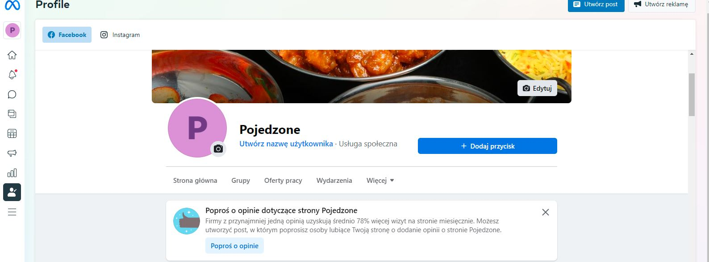
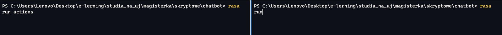
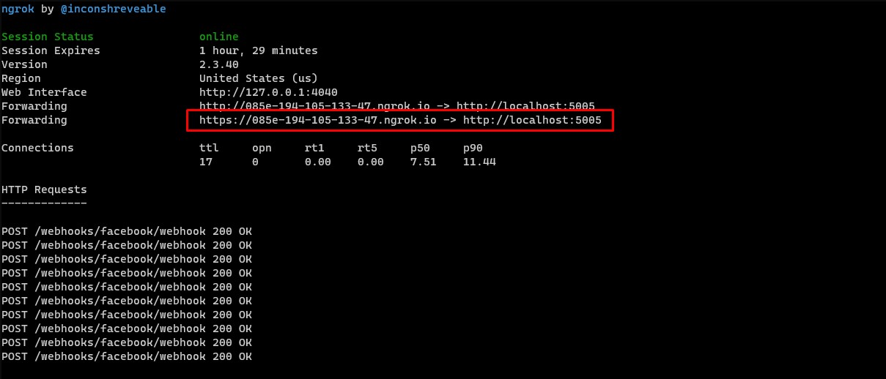
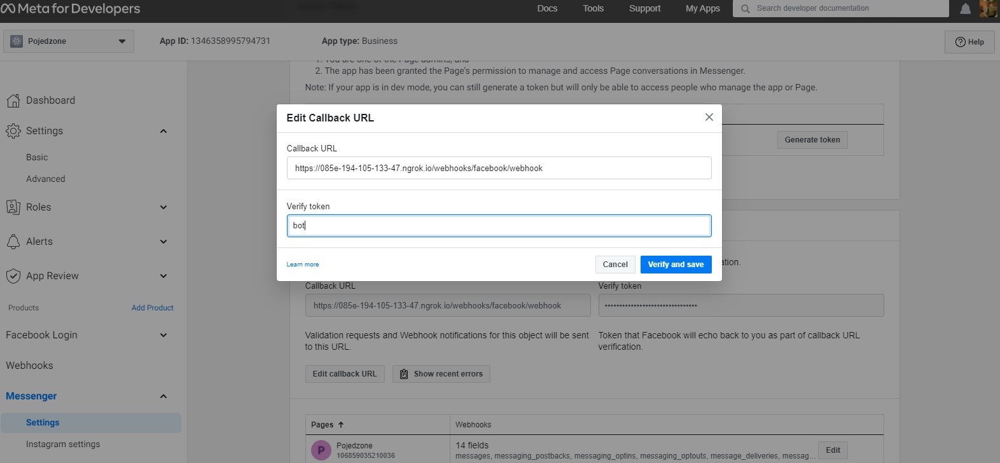

# Chatbot zamawiający potrawy z restauracji we frameworku RASA z wykorzystaniem języka Python

Do wykonania aplikacji wykorzystany został framework RASA.

Aplikacja składa sie z plików o rozszerzeniu  yaml, gdzie mamy wykorzystywane głównie 4 pliki:
* nlu.yaml -> przykładowe odpowiedzi wpisywane przrez użytkownika 
* domain.yaml -> podział intents, entities, slots, actions i przykładowe odpowiedzi bota
* stories.yaml -> przykładowe historie stworzone przez użytkownika i bota
* actions.py -> kod odpowiadający za przetwarzanie odpowiedzi i dalszy przebieg aplikacji

Aplikacja łączy się z serwisem Messenger i tam też bot odpowiada na zadane pytania.
Na potrzeby programu została utworzona strona na Facebooku:

W celu uruchomienia pliku odpowiadajacego akcjami zwiazanymi z chatbotem  została wykorzystana komenda:
` ras run actions `.
W celu uruchomienia pliku odpowiadajacego za główny program została wykorzystana komenda:
` ras run `.

W celu połaczenia programu z Messengerem wykorzystany został program ngrok, aplikacja wystawiona jest na porcie 5005, wykorzystana komenda:
` ngrok http 5005 `

Adres zaznaczony na czerwono podajemy w jako callback URL na stronie Facebooka:

Poniżej krótka demonstacja odpowiedzi Chatbota na Messengerze:

