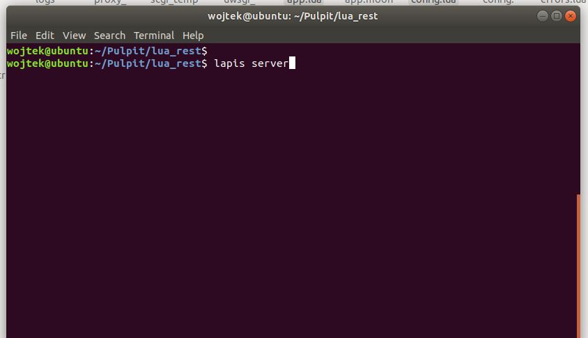
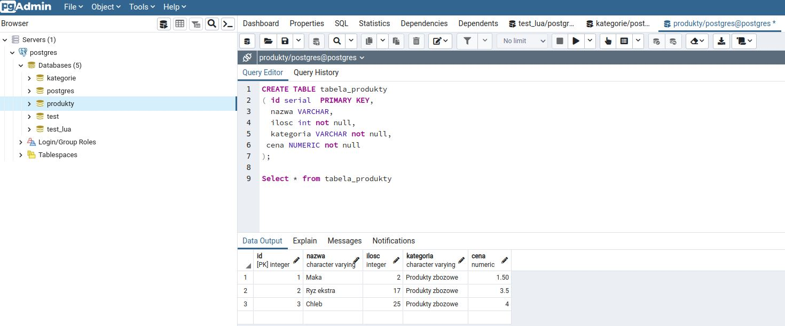
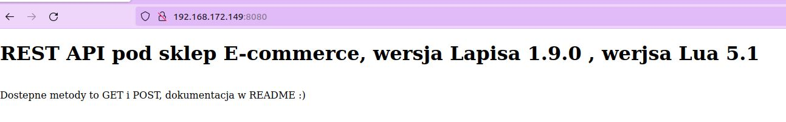
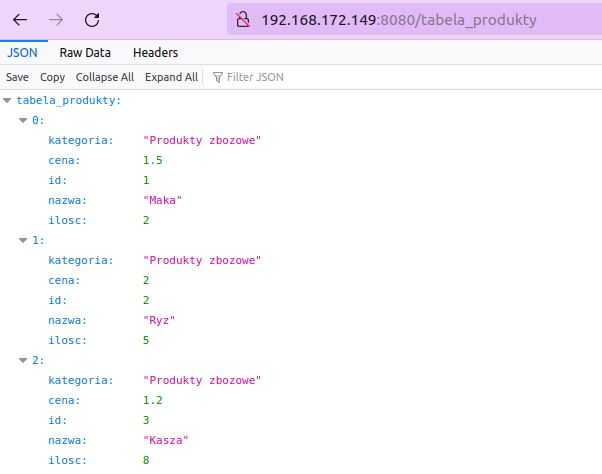
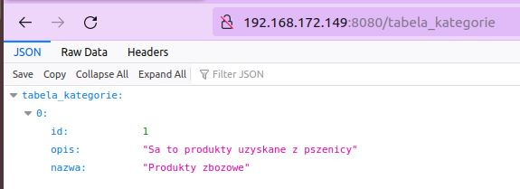
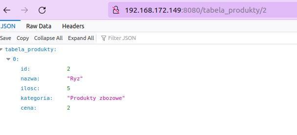
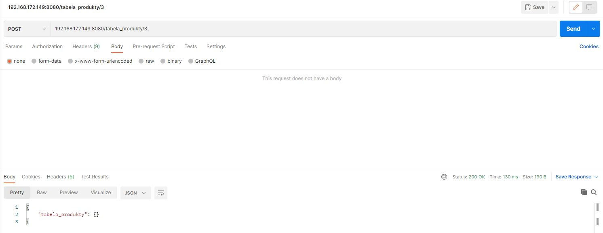
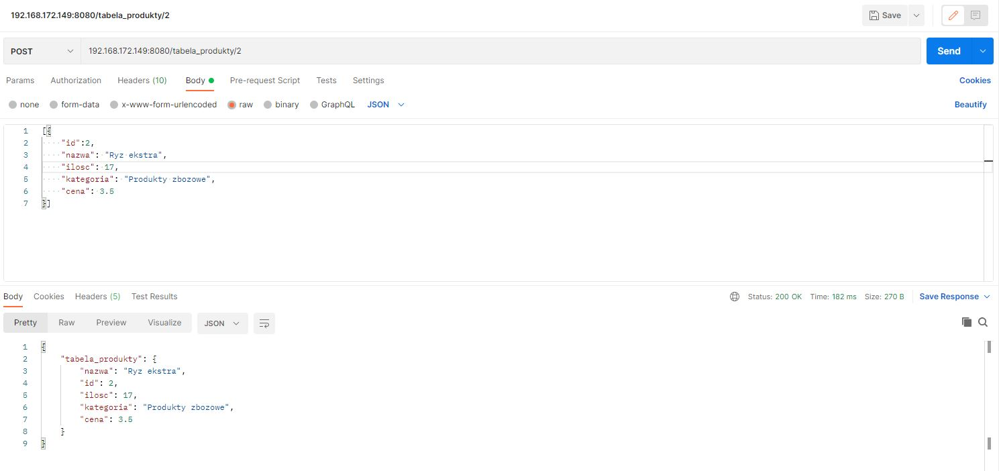
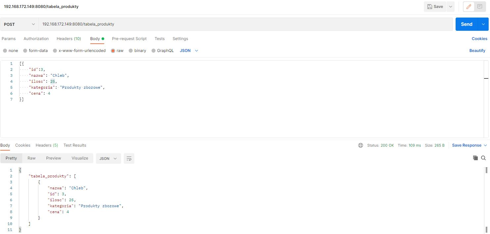
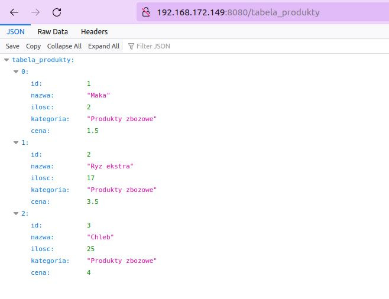

# REST API pod sklep Ecommerce w języku Lua z wykorzystaniem frameworka Lapis 

Do wykonania programu wykorzystana został frameowrk Lapis.

Wykonane zostało API, gdzie mamy endpointy pod kategorie oraz produkty, są one typu CRUD:
* Create
* Read (One, Many )
* Update
* Delete

W celu utworzenia plików do projektu została wykorzystana komenda:
` lapis new `.
W pliku nginx.conf, znajduje się konfiguracja nginxa, który jest odpalany abyśmy się mogli łączyć do API. Aplikacja jest wystawiona lokalnie na porcie 8080.
Za start servera oraz wystartowanie głównego programu 'app.lua', gdzie została zawarta cała logika aplikacji odpowiada komenda:
` lapis server `  

Program łączy się z bazą danych PostgreSQL, modele zostały utworzone za pomocą 'lapis.db.model'. Konfig do połączenia się z bazą danych znajduje się w pliku config.lua. 
W postgresie zostały utworzoe dwie tabele: produkty oraz kategorie:  

W celu wysłania metody GET do API używam przeglądarki, w celu wysłania metody POST używam programu Postman.

Wysyłanie zapytań do API:
* GET  /  ->  Główna strona

* GET  /tabela_produkty -> zwraca wszystkie rekordy z tabeli produkty

* GET  /tabela_kategorie -> zwraca wszystkie rekordy z tabeli kategorie, analogicznie wyglądaja pozostałe zapytania dla tych dwóch tabel

* GET  /tabela_produkty/2 -> zwraca rekord  o id=2 z tabeli produkty

* POST  /tabela_produkty/3 -> usuwa rekord  o id=3 z tabeli produkty

* POST  /tabela_produkty/2 -> update  rekordu  o id=2 dla tabeli produkty

* POST  /tabela_produkty -> stworzenie  rekordu  o id=4 dla tabeli produkty

Koncowy widok tabeli:

